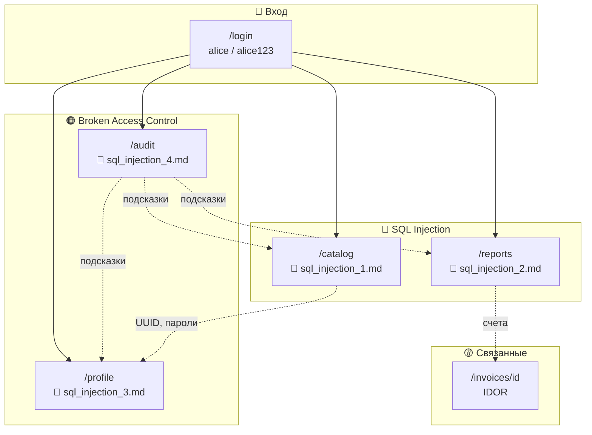

# Security BD — учебный стенд по безопасности БД

<p align="center">
  
  
  
  
  
</p>

<p align="center">
  <strong>Учебный портал с намеренными уязвимостями</strong><br/>
  для практики по SQL-инъекциям, контролю доступа и защите PostgreSQL
</p>

<p align="center">
  <a href="#-быстрый-старт">Быстрый старт</a> •
  <a href="#-документация-по-уязвимостям">Документация</a> •
  <a href="#-карта-стенда">Карта стенда</a> •
  <a href="#-учётные-записи">Учётные записи</a>
</p>

---

## О проекте

Сайт с уязвимостями для курса **«Безопасность БД»** СурГУ.  
Основан на стенде [DB_SEC_SITE](https://github.com/Wheatgrh/DB_SEC_SITE).

В репозитории — исходный код приложения и **подробные отчёты** по четырём практическим заданиям: как найти уязвимость, как проверить и как исправить.

---

## Быстрый старт

**Требования:** [Docker](https://www.docker.com/) и Docker Compose.

```bash
# Сборка и запуск
docker compose up --build

# Остановка и удаление всех данных БД
docker compose down -v
```

| Сервис | URL |
|--------|-----|
| Веб-приложение | http://localhost:3000 |
| PostgreSQL | `localhost:5432` |

---

## Документация по уязвимостям

<p align="center">
  
  
  
</p>

### Обзор заданий

| № | Документ | Страница | Тип | Сложность |
|:-:|----------|----------|-----|:---------:|
| 1 | [**sql_injection_1.md**](./sql_injection_1.md) | [`/catalog`](http://localhost:3000/catalog) | SQL Injection | ⭐⭐ |
| 2 | [**sql_injection_2.md**](./sql_injection_2.md) | [`/reports`](http://localhost:3000/reports) | SQL Injection (SECURITY DEFINER) | ⭐⭐⭐ |
| 3 | [**sql_injection_3.md**](./sql_injection_3.md) | [`/profile`](http://localhost:3000/profile) | Privilege Escalation + IDOR | ⭐⭐ |
| 4 | [**sql_injection_4.md**](./sql_injection_4.md) | [`/audit`](http://localhost:3000/audit) | Broken Access Control | ⭐ |

---

### Задание 1 — SQL-инъекция в каталоге клиентов

<p>
  <a href="./sql_injection_1.md">
    
  </a>
</p>

| | |
|---|---|
| **Страница** | Клиенты → `/catalog` |
| **Вектор** | GET-параметр `q` в поиске по email |
| **Суть** | Конкатенация ввода в `ILIKE '%...%'` |
| **Payload** | `%` · `' OR '1'='1` · `UNION SELECT ... FROM app_users` |
| **В отчёте** | Проверка · Impact · Исправление в `db.ts` и `01-schema.sql` |

---

### Задание 2 — SQL-инъекция в пользовательских отчётах

<p>
  <a href="./sql_injection_2.md">
    
  </a>
</p>

| | |
|---|---|
| **Страница** | SQL Reports → `/reports` |
| **Вектор** | POST-поле `whereClause` (фрагмент WHERE) |
| **Суть** | `EXECUTE format(...)` в функции `training.run_custom_report` |
| **Payload** | `1=1` · `1=0 UNION SELECT username, password ...` |
| **В отчёте** | Почему `$1` в Node.js не спасает · `SECURITY DEFINER` · исправление в БД |

---

### Задание 3 — повышение привилегий в профиле

<p>
  <a href="./sql_injection_3.md">
    
  </a>
</p>

| | |
|---|---|
| **Страница** | Профиль → `/profile` |
| **Вектор** | `POST /api/users/{id}/profile` + скрытое поле `roleName` |
| **Суть** | SQL-инъекции нет; API доверяет `id` и роли из запроса |
| **Эксплуатация** | `roleName=admin` в DevTools Console |
| **В отчёте** | IDOR на bob · исправление API и разделение смены роли |

---

### Задание 4 — несанкционированный доступ к аудиту

<p>
  <a href="./sql_injection_4.md">
    
  </a>
</p>

| | |
|---|---|
| **Страница** | Аудит → `/audit` |
| **Вектор** | Прямой URL без проверки роли |
| **Суть** | Студент видит служебный журнал (BYPASSRLS, role_change, DDL) |
| **Эксплуатация** | Войти как `alice` → открыть `/audit` |
| **В отчёте** | Проверка роли `admin` · скрытие ссылки · RLS на `audit_events` |

---

## Карта стенда



---

## Учётные записи

| Пользователь | Пароль | Роль | Назначение |
|:------------:|:------:|:----:|------------|
| `alice` | `alice123` | `student` | Основная учётка для атак |
| `bob` | `bob123` | `manager` | Жертва IDOR (задание 3) |
| `carol` | `carol123` | `admin` | Эталон полного доступа |

---

## Структура отчётов

Каждый файл `sql_injection_*.md` содержит единый шаблон:

```
📋 Краткое описание
📁 Затронутые файлы
🔍 Как устроена уязвимость
✅ Пошаговая проверка (payload'ы)
📊 Таблица сценариев / Impact
🛠️ Как исправить (по файлам с примерами кода)
🔄 Проверка после исправления
☑️ Чеклист для отчёта
```

---

## Стек технологий

| Слой | Технология |
|------|------------|
| Frontend | SvelteKit, TypeScript, Vite |
| Backend | SvelteKit Server Routes, Node.js |
| База данных | PostgreSQL 16 |
| Инфраструктура | Docker, Docker Compose |

---

## Структура репозитория

```
.
├── db/init/                  # Схема и seed-данные PostgreSQL
├── src/
│   ├── lib/server/db.ts      # Запросы к БД
│   └── routes/               # Страницы стенда
├── sql_injection_1.md        # Задание 1: /catalog
├── sql_injection_2.md        # Задание 2: /reports
├── sql_injection_3.md        # Задание 3: /profile
├── sql_injection_4.md        # Задание 4: /audit
├── docker-compose.yml
└── README.md
```

---

## Рекомендуемый порядок прохождения

```
1️⃣  sql_injection_1.md  →  SQL-инъекция в поиске (проще всего)
2️⃣  sql_injection_4.md  →  Аудит даёт подсказки к остальным
3️⃣  sql_injection_2.md  →  Инъекция в хранимой функции
4️⃣  sql_injection_3.md  →  Повышение привилегий через API
```

---

<p align="center">
  <sub>Учебный проект · СурГУ · Безопасность БД · 2026</sub>
</p>
