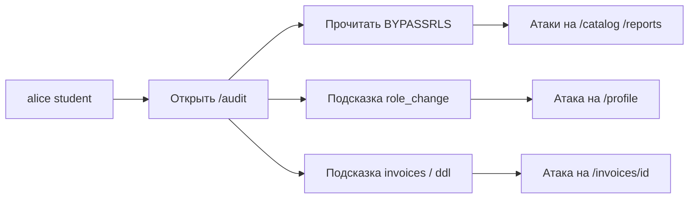

# Уязвимость №4: журнал аудита на странице `/audit`

Учебный стенд: [DB_SEC_SITE](https://github.com/Wheatgrh/DB_SEC_SITE)  
Раздел интерфейса: **Аудит** → `http://localhost:3000/audit`  
Тип уязвимости: **Broken Access Control** + **Information Disclosure**, **не SQL-инъекция**

> Файл назван `sql_injection_4.md` как четвёртое практическое задание стенда. На этой странице нет полей ввода и пользовательских параметров в SQL. Уязвимость — в отсутствии проверки роли при доступе к служебному журналу.

---

## Краткое описание

Страница «Журнал аудита» показывает внутренние события системы: bootstrap БД, неудачные входы, DDL-операции, смену ролей. Доступ к журналу должен быть ограничен ролью **admin**, но сейчас его видит **любой** авторизованный пользователь — в том числе студент `alice`.

Журнал не только раскрывает служебную информацию, но и **подсказывает** другие уязвимости стенда (BYPASSRLS, role_change, работа с invoices).

**SQL-инъекции здесь нет:** запрос к `training.audit_events` фиксированный, без подстановки ввода пользователя.

---

## Затронутые файлы

| Файл | Роль в уязвимости |
|------|-------------------|
| `src/routes/audit/+page.server.ts` | **Основной источник**: проверяется только факт входа, не роль |
| `src/lib/server/db.ts` | `listAuditEvents` — возвращает все события без фильтра по роли |
| `src/routes/audit/+page.svelte` | Отображает все поля `details` без маскирования |
| `src/routes/+layout.svelte` | Ссылка **Аудит** видна всем залогиненным пользователям |
| `db/init/02-seed.sql` | Тестовые записи аудита с подсказками для атакующего |

---

## Содержимое журнала (seed-данные)

После инициализации БД в `training.audit_events` записаны 4 события:

| Actor | Action | Details | Что раскрывает |
|-------|--------|---------|----------------|
| postgres | bootstrap | Database initialized with intentionally unsafe grants and **BYPASSRLS**. | Слабая конфигурация БД, обход RLS |
| alice | login_failed | Wrong password from **172.20.0.15** | Внутренний IP, факт брутфорса |
| bob | ddl | Executed `CREATE TEMP TABLE tmp_report AS SELECT * FROM training.invoices` | Имена таблиц, сценарий с invoices |
| carol | role_change | Changed alice from **student** to **manager** during a prior exercise. | Подсказка к уязвимости `/profile` |

Студент, прочитав журнал, получает карту дальнейших атак без исследования кода.

---

## Как устроена уязвимость

### 1. Загрузка страницы

Код `src/routes/audit/+page.server.ts`:

```typescript
export async function load({ locals }) {
    if (!locals.user) {
        redirect(303, '/login');
    }

    return {
        events: await listAuditEvents()
    };
}
```

**Проверяется:** есть ли cookie сессии (`locals.user`).  
**Не проверяется:** роль (`student`, `manager`, `admin`).

### 2. Запрос к базе данных

Код `src/lib/server/db.ts`:

```typescript
export async function listAuditEvents() {
    const result = await pool.query(
        `
            SELECT id, actor_username, action, details, created_at
            FROM training.audit_events
            ORDER BY created_at DESC
            LIMIT 50
        `
    );

    return result.rows;
}
```

Запрос статический — параметров от клиента нет. Это **безопасно с точки зрения SQL**, но **небезопасно с точки зрения авторизации**: выборка полная, без `WHERE` по роли или пользователю.

### 3. Навигация не скрывает раздел

В `src/routes/+layout.svelte` ссылка на аудит отображается для всех авторизованных:

```svelte
<a href="/audit">Аудит</a>
```

Нет условия `{#if data.user.role === 'admin'}`.

### 4. Цепочка эксплуатации



---

## Предусловия для проверки

1. Запущен стенд: `docker compose up --build`
2. Приложение: http://localhost:3000
3. Вход: `alice` / `alice123`
4. В шапке: **Сессия: alice (student)**

---

## Пошаговая проверка уязвимости

### Шаг 1. Контроль — вход под студентом

1. Откройте http://localhost:3000
2. Войдите: `alice` / `alice123`
3. Убедитесь в шапке: `alice (student)`

---

### Шаг 2. Открыть журнал аудита

1. В меню нажмите **Аудит**  
   или откройте напрямую: http://localhost:3000/audit

**Ожидаемый результат:** страница загружается без ошибки 403 — доступ **не запрещён**.

**Вывод:** раздел не ограничен ролью admin.

---

### Шаг 3. Проверить полноту данных

В таблице должны быть **4 записи**:

1. `postgres` / `bootstrap` — текст про **BYPASSRLS**
2. `alice` / `login_failed` — IP `172.20.0.15`
3. `bob` / `ddl` — `CREATE TEMP TABLE ... training.invoices`
4. `carol` / `role_change` — смена роли alice

**Ожидаемый результат:** все строки видны студенту.

**Вывод:** утечка служебной информации (Information Disclosure).

---

### Шаг 4. Сравнение с учётной записью admin

1. Нажмите **Выход**
2. Войдите: `carol` / `carol123` (роль admin)
3. Снова откройте http://localhost:3000/audit

**Ожидаемый результат:** тот же набор из 4 записей.

**Вывод:** студент и admin видят **одинаковый** журнал — нет разграничения доступа (Broken Access Control).

---

### Шаг 5. Прямой доступ по URL (обход UI)

1. Снова войдите как `alice`
2. В адресной строке введите: `http://localhost:3000/audit`
3. Нажмите Enter

**Ожидаемый результат:** журнал открывается, даже если пользователь не переходил по меню.

**Вывод:** защита отсутствует на уровне маршрута, а не только в интерфейсе.

---

### Шаг 6. Подтвердить отсутствие SQL-инъекции

1. Откройте **F12** → **Network**
2. Обновите страницу `/audit`
3. Найдите запрос к `/audit`

**Ожидаемый результат:**

- в URL **нет** query-параметров (`?q=`, `?filter=` и т.д.);
- на странице **нет** форм ввода;
- в ответе — готовый список `events`, без отражения пользовательского SQL.

**Вывод:** это не SQL-инъекция, а ошибка авторизации.

---

### Шаг 7. Использование утечки для дальнейших атак (связь со стендом)

Прочитав журнал, `alice` узнаёт:

| Запись в аудите | Куда идти дальше |
|-----------------|------------------|
| BYPASSRLS | `/catalog`, `/reports` — SQL-инъекции |
| role_change | `/profile` — `roleName=admin` |
| training.invoices | `/invoices/[id]` — IDOR по UUID |

Это подтверждает, что утечка в аудите **усиливает** другие уязвимости.

---

## Сводная таблица проверок

| Проверка | Роль | Ожидаемо (уязвимо) | Ожидаемо (после исправления) |
|----------|------|--------------------|-----------------------------|
| Открыть `/audit` | student | 200, 4 записи | 403 Forbidden |
| Открыть `/audit` | manager | 200, 4 записи | 403 Forbidden |
| Открыть `/audit` | admin | 200, 4 записи | 200, 4 записи |
| Ссылка в меню | student | Видна | Скрыта |
| SQL-инъекция | любая | Невозможна | Невозможна |

---

## Влияние (Impact)

- **Конфиденциальность:** раскрытие внутренних IP, имён таблиц, конфигурации БД
- **Конфиденциальность:** раскрытие истории смены ролей и служебных операций
- **Разведка (recon):** журнал служит «шпаргалкой» для остальных заданий стенда
- **Compliance:** нарушение принципа least privilege — студент читает admin-only данные

---

## Почему это не SQL-инъекция

| Критерий | `/catalog`, `/reports` | `/audit` |
|----------|------------------------|----------|
| Пользовательский ввод в SQL | Да | Нет |
| Параметры URL / формы | Есть | Нет |
| CWE | CWE-89 | CWE-200, CWE-862 |
| Тип атаки | Подмена SQL | Несанкционированное чтение |

---

## Как исправить

Исправление — на уровне **авторизации** (приложение + UI + опционально БД).

---

### Исправление 1. Проверка роли в обработчике страницы (обязательно)

**Файл:** `src/routes/audit/+page.server.ts`

**Что добавить:** доступ только для `admin`.

**Было:**

```typescript
import { redirect } from '@sveltejs/kit';
import { listAuditEvents } from '$lib/server/db';

export async function load({ locals }) {
    if (!locals.user) {
        redirect(303, '/login');
    }

    return {
        events: await listAuditEvents()
    };
}
```

**Стало:**

```typescript
import { error, redirect } from '@sveltejs/kit';
import { listAuditEvents } from '$lib/server/db';

export async function load({ locals }) {
    if (!locals.user) {
        redirect(303, '/login');
    }

    if (locals.user.role !== 'admin') {
        error(403, 'Audit log is available to administrators only');
    }

    return {
        events: await listAuditEvents()
    };
}
```

**Почему:** проверка на сервере обязательна — скрытие ссылки в меню недостаточно (URL можно открыть напрямую).

---

### Исправление 2. Скрыть ссылку в навигации для не-admin

**Файл:** `src/routes/+layout.svelte`

**Что изменить:** показывать **Аудит** только администратору.

**Было:**

```svelte
<a href="/audit">Аудит</a>
```

**Стало:**

```svelte
{#if data.user?.role === 'admin'}
    <a href="/audit">Аудит</a>
{/if}
```

**Почему:** уменьшает поверхность атаки и не даёт студенту лишнюю подсказку. Это **дополнение**, не замена серверной проверки.

---

### Исправление 3. Вынести проверку прав в переиспользуемую функцию

**Файл:** создать `src/lib/server/auth.ts` (новый)

```typescript
import { error } from '@sveltejs/kit';
import type { AppUser } from '$lib/server/db';

export function requireRole(user: AppUser | null, ...roles: string[]): AppUser {
    if (!user) {
        error(401, 'Authentication required');
    }

    if (!roles.includes(user.role)) {
        error(403, 'Insufficient permissions');
    }

    return user;
}
```

**Файл:** `src/routes/audit/+page.server.ts`

```typescript
import { requireRole } from '$lib/server/auth';

export async function load({ locals }) {
    requireRole(locals.user, 'admin');

    return {
        events: await listAuditEvents()
    };
}
```

**Почему:** единый стиль проверок для `/audit`, будущих admin-страниц и API.

---

### Исправление 4. Маскирование чувствительных полей (рекомендуется)

**Файл:** `src/routes/audit/+page.server.ts` или `src/lib/server/db.ts`

Даже для admin можно не показывать полный `details` без необходимости:

```typescript
function sanitizeAuditEvent(event: AuditEvent): AuditEvent {
    return {
        ...event,
        details: event.action === 'login_failed'
            ? event.details.replace(/\d+\.\d+\.\d+\.\d+/, '[redacted]')
            : event.details
    };
}
```

Для студентов записи не отдаются вовсе (исправление 1). Маскирование — дополнительный слой для admin UI.

---

### Исправление 5. Ограничение на уровне БД (опционально)

**Файл:** `db/init/01-schema.sql`

Включить RLS на `audit_events` и убрать `BYPASSRLS` у `app_user` (см. `sql_injection_1.md`):

```sql
ALTER TABLE training.audit_events ENABLE ROW LEVEL SECURITY;

CREATE POLICY audit_admin_only ON training.audit_events
    FOR SELECT
    USING (
        current_setting('app.current_user_role', true) = 'admin'
    );
```

**Файл:** `src/hooks.server.ts` — выставлять роль сессии:

```typescript
await pool.query(
    `SELECT set_config('app.current_user_role', $1, false)`,
    [event.locals.user?.role ?? '']
);
```

**Почему:** защита в глубину (defense in depth) — даже при ошибке в коде приложения БД не отдаст аудит студенту.

**Пересоздание БД:**

```bash
docker compose down -v
docker compose up --build
```

---

### Исправление 6. Разделить аудит на «публичный» и «служебный» (альтернатива)

Если студентам нужен **свой** журнал действий:

**Файл:** `src/lib/server/db.ts` — новая функция:

```typescript
export async function listAuditEventsForUser(username: string) {
    const result = await pool.query(
        `
            SELECT id, actor_username, action, details, created_at
            FROM training.audit_events
            WHERE actor_username = $1
            ORDER BY created_at DESC
            LIMIT 20
        `,
        [username]
    );

    return result.rows;
}
```

**Файл:** `src/routes/audit/+page.server.ts`

```typescript
if (locals.user.role === 'admin') {
    return { events: await listAuditEvents(), fullAccess: true };
}

return {
    events: await listAuditEventsForUser(locals.user.username),
    fullAccess: false
};
```

Студент видит только свои события (`login_failed` для alice), без bootstrap и role_change.

---

### Исправление 7. Убрать подсказки из seed-данных (для production)

**Файл:** `db/init/02-seed.sql`

В учебном стенде записи намеренно содержат подсказки. В реальной системе `details` не должны включать:

- флаги конфигурации (`BYPASSRLS`);
- прямые указания на уязвимости;
- внутренние IP без маскирования.

---

## Проверка после исправления

Повторите шаги 2–5 из раздела «Проверка».

| Тест | До исправления | После исправления |
|------|----------------|-------------------|
| `alice` открывает `/audit` | 200, 4 записи | **403** |
| `bob` открывает `/audit` | 200, 4 записи | **403** |
| `carol` открывает `/audit` | 200, 4 записи | 200, 4 записи |
| Ссылка «Аудит» у alice | Видна | **Скрыта** |
| Прямой URL `/audit` у alice | Работает | **403** |

Дополнительно: в Network ответ с кодом 403 и сообщением о недостатке прав.

---

## Сравнение с заданиями №1–№3

| | №1 `/catalog` | №2 `/reports` | №3 `/profile` | №4 `/audit` |
|--|---------------|---------------|---------------|-------------|
| Тип | SQL Injection | SQL Injection (в БД) | Privilege Escalation / IDOR | Broken Access Control |
| Ввод пользователя | GET `q` | POST `whereClause` | POST `roleName`, URL `{id}` | Нет |
| Эксплуатация | Payload в SQL | Payload в WHERE | Скрытое поле в API | Открыть URL |
| CWE | CWE-89 | CWE-89 | CWE-269, CWE-639 | CWE-862, CWE-200 |
| Документ | `sql_injection_1.md` | `sql_injection_2.md` | `sql_injection_3.md` | `sql_injection_4.md` |

---

## Чеклист для отчёта по практике

- [ ] Указано: на `/audit` нет SQL-инъекции
- [ ] Описана проверка только `locals.user`, без `role`
- [ ] Зафиксирован доступ `alice (student)` к полному журналу
- [ ] Перечислены 4 seed-записи и их значение для разведки
- [ ] Сравнение доступа alice vs carol (одинаковые данные)
- [ ] Описано исправление: `error(403)` для не-admin в `audit/+page.server.ts`
- [ ] Описано скрытие ссылки в `+layout.svelte`
- [ ] Упомянута опциональная защита RLS на `audit_events`

---

## Связанные уязвимости на стенде

- **Инъекция №1** — `/catalog` → `sql_injection_1.md`
- **Инъекция №2** — `/reports` → `sql_injection_2.md`
- **Уязвимость №3** — `/profile` (role_change из аудита) → `sql_injection_3.md`
- **Invoice demo** — IDOR `/invoices/[id]` (подсказка из записи bob / ddl)

Данный документ относится к уязвимости №4 на странице `/audit`.
