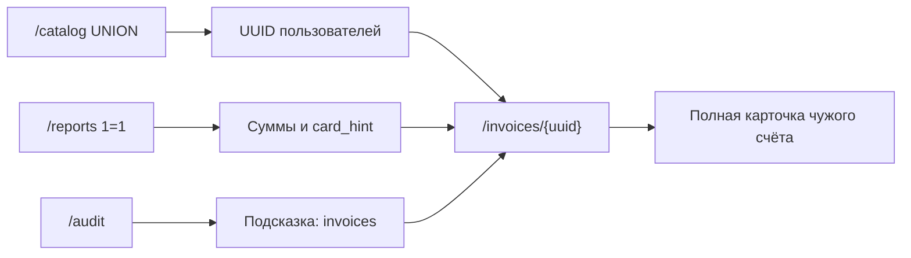

# Уязвимость №6: IDOR счетов на странице `/invoices/[id]`

Учебный стенд: [DB_SEC_SITE](https://github.com/Wheatgrh/DB_SEC_SITE)  
Раздел интерфейса: **Invoice demo** → `http://localhost:3000/invoices/{uuid}`  
Тип уязвимости: **IDOR** (Insecure Direct Object Reference), **не SQL-инъекция**

> Файл назван `sql_injection_6.md` как шестое практическое задание стенда. SQL-запрос параметризован (`$1`), инъекции нет. Уязвимость — в отсутствии проверки владельца счёта при доступе по UUID в URL.

---

## Краткое описание

Страница детализации счёта открывается по прямой ссылке `/invoices/{id}`, где `{id}` — UUID записи в `training.invoices`. Сервер проверяет только **факт авторизации** (есть ли сессия), но **не сверяет** владельца счёта с текущим пользователем.

Студент `alice` по задумке должен видеть только свои счета. Подставив UUID чужого счёта в адресную строку, она получает полную карточку: email клиента, сумму, `card_hint` и **внутренние заметки** (в том числе admin-only).

В seed-данных на счёте alice прямо указано: *«Alice can normally justify access only to this invoice.»*

---

## Затронутые файлы

| Файл | Роль в уязвимости |
|------|-------------------|
| `src/routes/invoices/[id]/+page.server.ts` | **Основной источник**: нет проверки `owner_user_id` / `owner_username` |
| `src/lib/server/db.ts` | `getInvoiceById` — выборка по `$1` без фильтра по владельцу |
| `src/routes/invoices/[id]/+page.svelte` | Отображает PII и `notes` без маскирования |
| `src/routes/+layout.svelte` | Ссылка **Invoice demo** ведёт только на один UUID (alice) |
| `db/init/02-seed.sql` | UUID всех счетов и тексты заметок |

---

## Счета в системе (seed-данные)

| UUID | Владелец | Клиент | Сумма | Status | Card hint |
|------|----------|--------|-------|--------|-----------|
| `f11d0794-51d4-4824-8c4e-7d79c42f1275` | alice | Ivan Petrov | 1800.00 | paid | 4242 |
| `25c3318b-9a6b-463c-bdd5-b6b94b4953d5` | alice | Olga Sidorova | 9500.00 | overdue | 1881 |
| `45e7035b-689d-41a4-b3b9-8940e3740bf9` | bob | Denis Morozov | 15250.00 | pending | 7003 |
| `004f7c74-a6e1-4f4b-ab8d-e2e4f7164339` | carol | Natalia Volkova | 49999.00 | draft | 9911 |

**Заметки (notes) — чувствительные:**

| UUID | Текст notes |
|------|-------------|
| `f11d0794-...` | Alice can normally justify access only to this invoice. |
| `25c3318b-...` | Contains overdue debt details for another exercise. |
| `45e7035b-...` | Bob uses this invoice in manager workflows. |
| `004f7c74-...` | **Admin-only draft with sensitive internal comments.** |

---

## Как устроена уязвимость

### 1. Маршрут и параметр URL

Пользователь открывает:

```
GET /invoices/f11d0794-51d4-4824-8c4e-7d79c42f1275
```

SvelteKit передаёт `params.id` в обработчик загрузки страницы.

### 2. Обработчик без проверки владельца

Код `src/routes/invoices/[id]/+page.server.ts`:

```typescript
export async function load({ locals, params }) {
    if (!locals.user) {
        redirect(303, '/login');
    }

    const invoice = await getInvoiceById(params.id);
    if (!invoice) {
        error(404, 'Invoice not found');
    }

    return { invoice };
}
```

**Проверяется:**

| Проверка | Есть? |
|----------|:-----:|
| Пользователь залогинен | ✅ |
| Счёт существует в БД | ✅ |
| Счёт принадлежит текущему пользователю | ❌ |
| Роль admin/manager для чужих счетов | ❌ |

### 3. Запрос к БД (SQL безопасен)

Код `src/lib/server/db.ts`:

```typescript
export async function getInvoiceById(id: string) {
    const result = await pool.query(
        `
            SELECT
                i.id, i.amount, i.status, i.card_hint, i.notes, i.created_at,
                c.full_name AS customer_name,
                c.email AS customer_email,
                u.username AS owner_username
            FROM training.invoices i
            JOIN training.customers c ON c.id = i.customer_id
            JOIN training.app_users u ON u.id = i.owner_user_id
            WHERE i.id = $1
        `,
        [id]
    );

    return result.rows[0] ?? null;
}
```

`$1` защищает от SQL-инъекции в `id`, но запрос **не ограничивает** выборку владельцем — любой валидный UUID возвращает полную строку.

### 4. Что видит атакующий

Страница `+page.svelte` показывает без фильтрации:

- имя и **email** клиента;
- сумму, статус, **card_hint**;
- **внутренние заметки** (`notes`);
- username владельца счёта.

### 5. Связь с другими уязвимостями



UUID счетов можно узнать из `/reports`, аудита, `02-seed.sql` или перебора (в учебном стенде — 4 фиксированных значения).

---

## Предусловия для проверки

1. Запущен стенд: `docker compose up --build`
2. Приложение: http://localhost:3000
3. Вход: `alice` / `alice123`
4. В шапке: **Сессия: alice (student)**

---

## Пошаговая проверка уязвимости

### Шаг 1. Легитимный доступ — свой счёт

1. Войти как `alice`
2. В меню нажать **Invoice demo**  
   или открыть:

```
http://localhost:3000/invoices/f11d0794-51d4-4824-8c4e-7d79c42f1275
```

**Ожидаемый результат:**

| Поле | Значение |
|------|----------|
| Customer | Ivan Petrov |
| Email | ivan.petrov@example.org |
| Amount | 1800.00 |
| Card hint | 4242 |
| Владелец | alice |
| Заметка | Alice can normally justify access only to this invoice. |

**Вывод:** штатный доступ к своему счёту работает.

---

### Шаг 2. Второй свой счёт

Открыть:

```
http://localhost:3000/invoices/25c3318b-9a6b-463c-bdd5-b6b94b4953d5
```

**Ожидаемый результат:** Olga Sidorova, **9500.00**, card_hint `1881`, владелец alice.

---

### Шаг 3. IDOR — счёт bob

Подставить UUID счёта **bob** в URL:

```
http://localhost:3000/invoices/45e7035b-689d-41a4-b3b9-8940e3740bf9
```

**Ожидаемый результат:**

| Поле | Значение |
|------|----------|
| Customer | Denis Morozov |
| Email | denis.morozov@example.org |
| Amount | **15250.00** |
| Card hint | 7003 |
| Владелец | **bob** |
| Заметка | Bob uses this invoice in manager workflows. |

**Вывод:** студент `alice` читает финансовые данные менеджера — **IDOR подтверждён**.

---

### Шаг 4. IDOR — admin-only счёт carol (ключевой тест)

Открыть:

```
http://localhost:3000/invoices/004f7c74-a6e1-4f4b-ab8d-e2e4f7164339
```

**Ожидаемый результат:**

| Поле | Значение |
|------|----------|
| Customer | Natalia Volkova |
| Email | natalia.volkova@example.org |
| Amount | **49999.00** |
| Status | draft |
| Card hint | 9911 |
| Владелец | **carol** |
| Заметка | Admin-only draft with sensitive internal comments. |

**Вывод:** alice получает доступ к данным уровня admin — критическая утечка.

---

### Шаг 5. Несуществующий UUID

```
http://localhost:3000/invoices/00000000-0000-0000-0000-000000000000
```

**Ожидаемый результат:** **404 Invoice not found**.

**Вывод:** ID проверяется только на существование в БД, не на принадлежность пользователю.

---

### Шаг 6. Доступ без авторизации

1. Нажать **Выход**
2. Снова открыть URL чужого счёта (шаг 4)

**Ожидаемый результат:** редирект на `/login`.

**Вывод:** анонимный доступ закрыт, но **любой залогиненный** пользователь обходит изоляцию через IDOR.

---

### Шаг 7. Как получить UUID без знания seed

| Способ | Действие |
|--------|----------|
| Меню | **Invoice demo** → UUID alice в адресной строке |
| `/reports` | WHERE `1=1` → все счета (см. `sql_injection_2.md`) |
| `/catalog` | UNION с `app_users` → пароли, вход как bob/carol |
| `/audit` | Запись bob про `training.invoices` |
| Исходники | `db/init/02-seed.sql` |

---

## Сводная таблица проверок

| URL (кратко) | Владелец | alice может открыть? | IDOR? |
|--------------|----------|:--------------------:|:-----:|
| `...f11d0794...` | alice | ✅ | Нет |
| `...25c3318b...` | alice | ✅ | Нет |
| `...45e7035b...` | bob | ✅ | **Да** |
| `...004f7c74...` | carol | ✅ | **Да** |
| `...00000000...` | — | ❌ 404 | — |

---

## Влияние (Impact)

- **Конфиденциальность:** утечка email клиентов, сумм, `card_hint`
- **Конфиденциальность:** утечка внутренних `notes` (коммерческая тайна, admin-only)
- **Нарушение изоляции:** студент читает объекты manager и admin
- **Связь с цепочкой атак:** после `/reports` IDOR даёт **полную карточку**, а не только строку таблицы

---

## Почему это не SQL-инъекция

| Критерий | `/catalog`, `/reports` | `/invoices/[id]` |
|----------|------------------------|------------------|
| Пользовательский ввод в SQL | Да / частично | Нет (`$1` параметризован) |
| Вектор | Подмена SQL | Подмена UUID в URL |
| CWE | CWE-89 | CWE-639 (IDOR) |
| Тип атаки | Injection | Broken Access Control |

---

## Как исправить

---

### Исправление 1. Проверка владельца в обработчике страницы (обязательно)

**Файл:** `src/routes/invoices/[id]/+page.server.ts`

**Было:**

```typescript
const invoice = await getInvoiceById(params.id);
if (!invoice) {
    error(404, 'Invoice not found');
}

return { invoice };
```

**Стало:**

```typescript
import { error, redirect } from '@sveltejs/kit';
import { getInvoiceById } from '$lib/server/db';

export async function load({ locals, params }) {
    if (!locals.user) {
        redirect(303, '/login');
    }

    const invoice = await getInvoiceById(params.id);
    if (!invoice) {
        error(404, 'Invoice not found');
    }

    const isOwner = invoice.owner_username === locals.user.username;
    const isAdmin = locals.user.role === 'admin';

    if (!isOwner && !isAdmin) {
        error(403, 'You do not have access to this invoice');
    }

    return { invoice };
}
```

**Почему:** явная авторизация на уровне приложения — владелец или admin.

---

### Исправление 2. Фильтр владельца в запросе к БД

**Файл:** `src/lib/server/db.ts`

**Что сделать:** передавать `ownerUserId` и ограничивать выборку в SQL.

```typescript
export async function getInvoiceByIdForUser(id: string, userId: string, isAdmin: boolean) {
    const result = await pool.query(
        `
            SELECT
                i.id, i.amount, i.status, i.card_hint, i.notes, i.created_at,
                c.full_name AS customer_name,
                c.email AS customer_email,
                u.username AS owner_username
            FROM training.invoices i
            JOIN training.customers c ON c.id = i.customer_id
            JOIN training.app_users u ON u.id = i.owner_user_id
            WHERE i.id = $1
              AND ($2::boolean OR i.owner_user_id = $3)
        `,
        [id, isAdmin, userId]
    );

    return result.rows[0] ?? null;
}
```

**Файл:** `src/routes/invoices/[id]/+page.server.ts`

```typescript
const invoice = await getInvoiceByIdForUser(
    params.id,
    locals.user.id,
    locals.user.role === 'admin'
);
```

**Почему:** даже при ошибке в маршруте БД не отдаст чужую строку (defense in depth).

---

### Исправление 3. RLS на таблице `invoices` (уровень БД)

**Файл:** `db/init/01-schema.sql`

```sql
ALTER TABLE training.invoices ENABLE ROW LEVEL SECURITY;

CREATE POLICY invoice_owner_isolation ON training.invoices
    FOR SELECT
    USING (
        owner_user_id = COALESCE(
            NULLIF(current_setting('app.current_user_id', true), ''),
            '00000000-0000-0000-0000-000000000000'
        )::uuid
        OR current_setting('app.current_user_role', true) = 'admin'
    );
```

**Также:** убрать `BYPASSRLS` у `app_user` и выставлять `app.current_user_id` в `hooks.server.ts` (см. `sql_injection_1.md`).

---

### Исправление 4. Непредсказуемые идентификаторы (дополнительно)

UUID в seed известны заранее. В production:

- не раскрывать последовательные ID;
- логировать попытки доступа к чужим объектам;
- при 403 не различать «не существует» и «нет доступа» (опционально — единый 404).

---

### Исправление 5. Маскирование чувствительных полей

**Файл:** `src/routes/invoices/[id]/+page.svelte` или серверный слой

Для не-владельцев (если доступ всё же нужен менеджерам) маскировать `card_hint`:

```typescript
card_hint: isOwner ? invoice.card_hint : '****'
```

В учебном сценарии лучше полностью запретить доступ (исправление 1).

---

## Проверка после исправления

| Тест | До исправления | После исправления |
|------|----------------|-------------------|
| alice → свой счёт `f11d0794...` | 200 | 200 |
| alice → счёт bob `45e7035b...` | 200, данные bob | **403** |
| alice → счёт carol `004f7c74...` | 200, admin notes | **403** |
| carol (admin) → любой счёт | 200 | 200 |
| Несуществующий UUID | 404 | 404 |

---

## Место в цепочке практики

```
1. /audit        → подсказка про invoices
2. /catalog      → пароли пользователей
3. /reports      → сводка по всем счетам
4. /invoices/id  → полная карточка чужого счёта  ← это задание
5. /profile      → эскалация до admin
```

---

## Сравнение с другими заданиями

| | №1 catalog | №2 reports | №3 profile | №4 audit | №6 invoices |
|--|------------|------------|------------|----------|-------------|
| Тип | SQLi | SQLi | BAC / IDOR | BAC | **IDOR** |
| Вектор | `?q=` | `whereClause` | API body | URL | **URL `{uuid}`** |
| SQL безопасен? | Нет | Частично | Да | Да | **Да** |
| Документ | `sql_injection_1.md` | `sql_injection_2.md` | `sql_injection_3.md` | `sql_injection_4.md` | `sql_injection_6.md` |

---

## Чеклист для отчёта по практике

- [ ] Указано: IDOR, не SQL-инъекция
- [ ] Описан файл `invoices/[id]/+page.server.ts`
- [ ] Контроль: свой счёт alice открывается
- [ ] IDOR: счёт bob `45e7035b-...` открывается от alice
- [ ] IDOR: admin-счёт carol `004f7c74-...` с заметкой admin-only
- [ ] 404 на несуществующий UUID
- [ ] Описано исправление: проверка `owner_username` или `owner_user_id`
- [ ] Связь с `/reports` и цепочкой атак

---

## Связанные уязвимости на стенде

- **Инъекция №1** — `/catalog` → `sql_injection_1.md`
- **Инъекция №2** — `/reports` (узнать UUID и суммы) → `sql_injection_2.md`
- **Уязвимость №3** — `/profile` → `sql_injection_3.md`
- **Уязвимость №4** — `/audit` → `sql_injection_4.md`

Данный документ относится к уязвимости №6 — IDOR счетов на `/invoices/[id]`.
